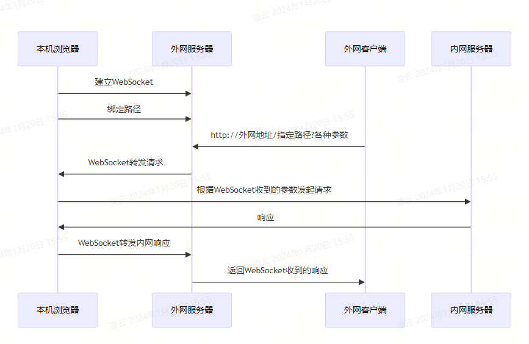
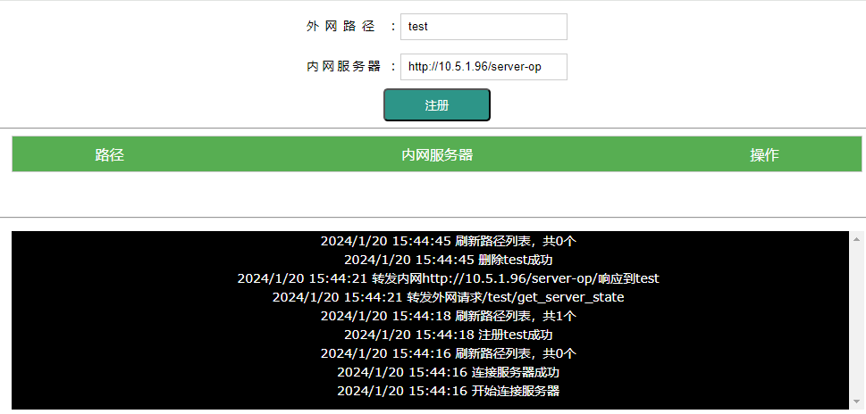

# ws2http
纯浏览器内网穿透

# 特性
现有很多内网穿透的开源项目，如frp、nps。功能也很强大，支持转发各种类型的协议。而实际上最常需要的应该是接口调试，这些需要额外下载客户端的项目反而有点复杂了。
本项目使用NodeJs开启了一个HTTP服务器，客户端访问网页即建立一个Websocket连接，可以添加转发到内网任意地址。流程为

# 安装/使用
[demo](http://ws2http.skyup.top/)
* 安装依赖库`npm install`
* 启动服务器 `node server.js 端口号`不指定端口默认为8080
  
# 常见问题
* `has been blocked by CORS policy: The request client is not a secure context and the resource is in more-private address space private.`
  > 浏览器跨域限制，打开chrome://flags， 关闭 Block insecure private network requests
* `Mixed Content: The page at 'https://xxx' was loaded over HTTPS, but requested an insecure XMLHttpRequest endpoint 'http://10.5.1.96/xxx'. This request has been blocked; the content must be served over HTTPS.
  > 浏览器不允许在https网站访问http的请求，外网换成http或者打开chrome://flags，激活并配置Insecure origins treated as secure
# 界面

# TODO
* 添加cookie以绑定请求和响应，防止多个请求转发异常
* 支持`HEADER`、`CODE`
